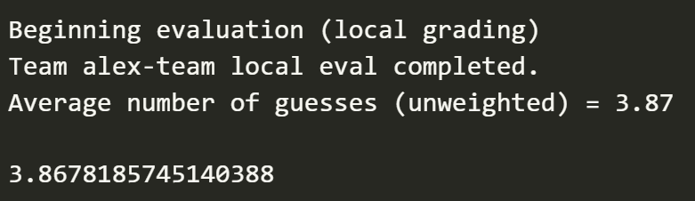

## My fork
Hello, its Alex! I added a simple beta guesser for the ipynb. Here are my results so far:


I added a script playwright.ipynb to use playwright to steal the strategy from this website: https://sadmoody.github.io/unwordle/
```
pip install playwright
python -m playwright install chromium
sudo apt-get update
sudo apt-get install -y libnspr4 libnss3
python -m playwright install-deps

```

# UChicago Wordle Tournament

Welcome... We're testing stuff out right now so there isn't much to say.

To install the tournament lib with pip, see the lib release here: https://github.com/Algo-Group-UChicago/wordle-tournament-lib/releases/tag/beta-testers-feedback

Install that mf and try to work through tournament.ipynb in this repo. Thank you!


